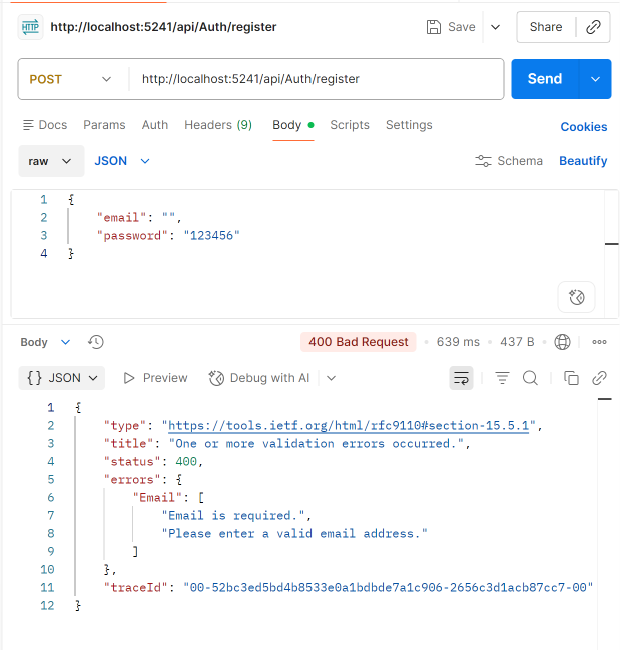
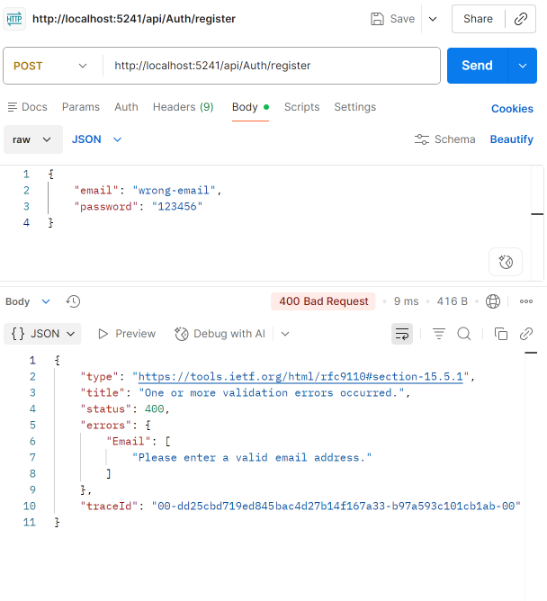
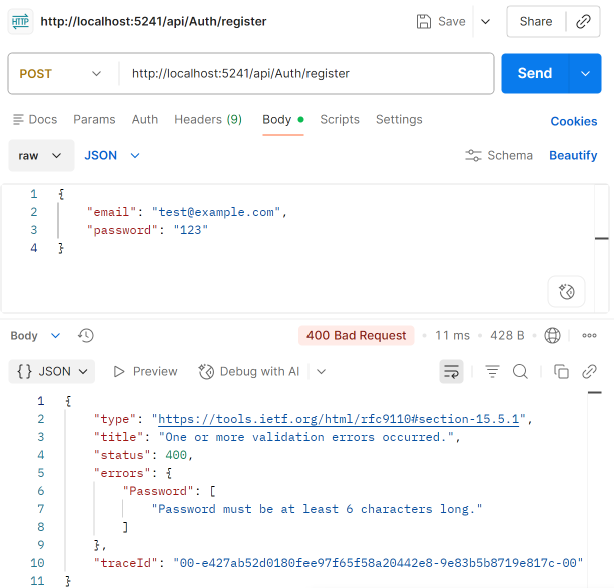
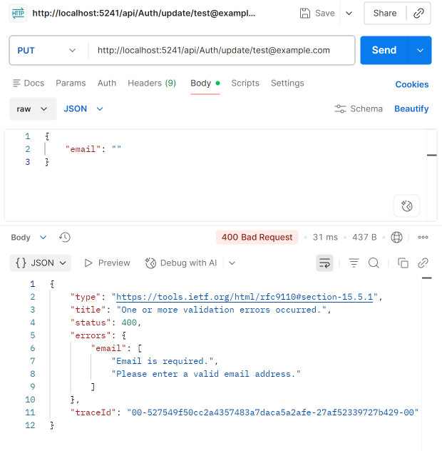
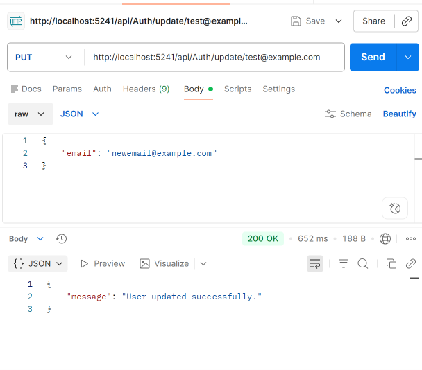

# Day 4 — Input Validation with FluentValidation

## What I Learned

* Using FluentValidation for input validation.
* Creating validators with custom rules and messages.
* Integrating validation into the ASP.NET Core pipeline.
* Testing validation errors using Postman.

## What I Implemented

* Added FluentValidation.
* Created `RegisterValidator` and `UpdateUserValidator`.
* Added automatic `400 Bad Request` validation.
* Tested valid and invalid requests in Postman.

## Screenshots

### Register Validation

### Invalid Email

### Short Password

### Update Validation

### Valid Request

## Technologies

C# • ASP.NET Core Web API • FluentValidation • Postman
