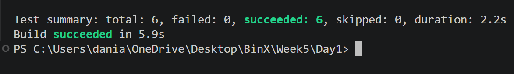
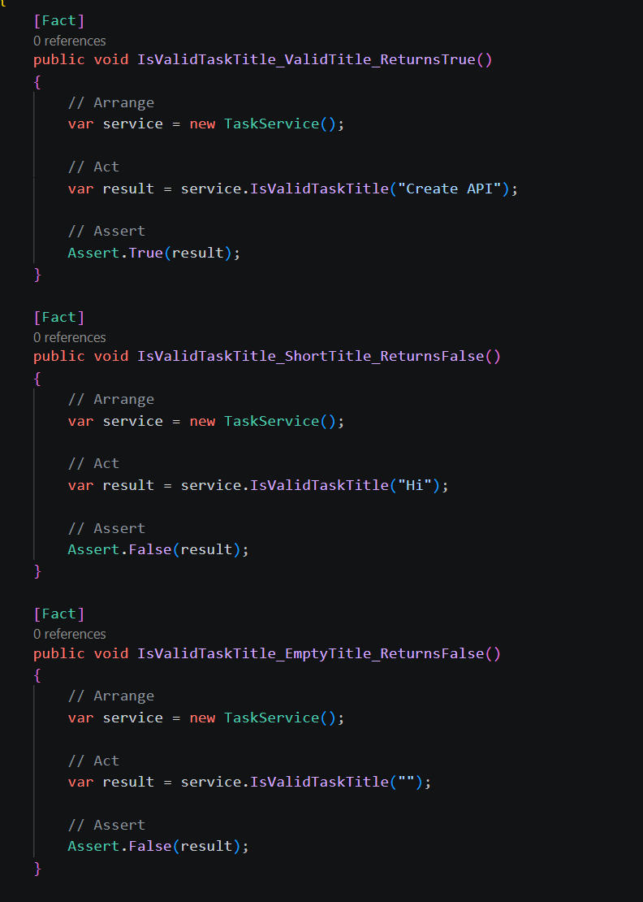
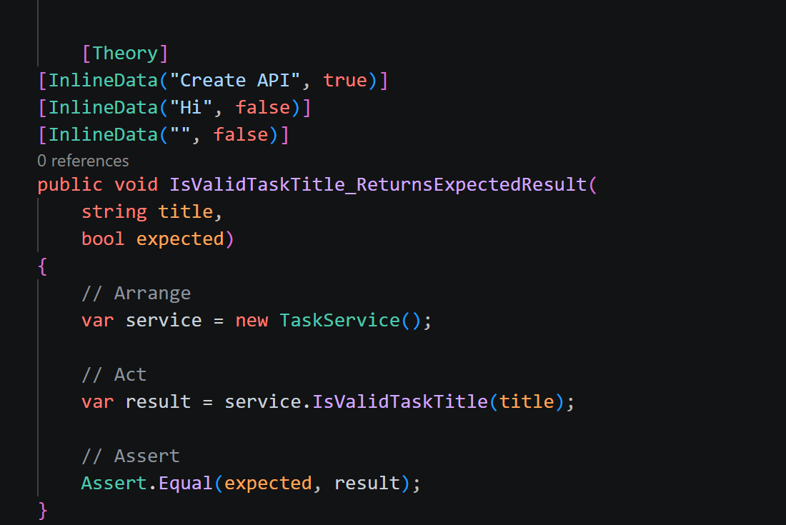

# Day 1 — Phase 3 Project & Unit Testing

## What I Did

* Selected **Task & Project Management API** as my Phase 3 project.
* Created an xUnit test project and connected it to the API.
* Applied the **Arrange-Act-Assert (AAA)** pattern.
* Wrote 3 `[Fact]` tests and 1 `[Theory]` test with 3 test cases.
* All **6 tests passed successfully**.

## Technologies

* C#
* .NET 9
* xUnit

## Screenshots

### Tests Passed

### Fact Tests

### Theory Test

