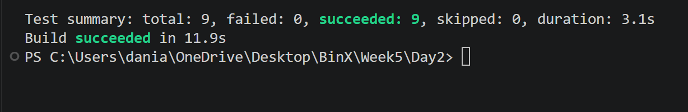

# Day 2 — Mocking Dependencies with Moq

## What I Did

* Used **Moq** to mock the task repository dependency.
* Tested mocked return values and exceptions.
* Used `Verify()` to confirm a repository method was called exactly once.
* All **9 tests passed successfully**.

## Technologies

* C#
* .NET 9
* xUnit
* Moq

## Screenshot

