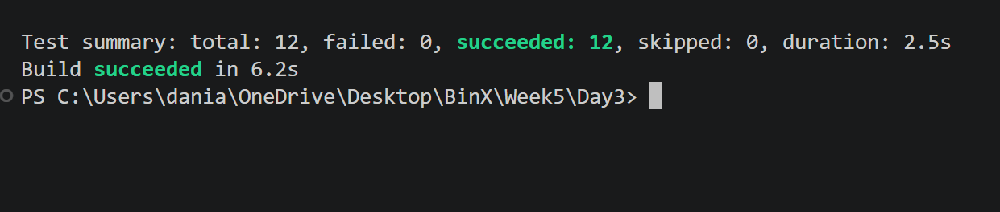

# Day 3 – Integration Testing

## What I Did

- Created integration tests using xUnit.
- Tested protected, admin, and manage endpoints.
- Configured an InMemory database for testing.
- Verified authentication and authorization behavior.
- Ran all tests successfully.

## Test Result

All 12 tests passed successfully.

## Technologies

- C#
- ASP.NET Core Web API
- xUnit
- Entity Framework Core
- InMemory Database
- JWT Authentication