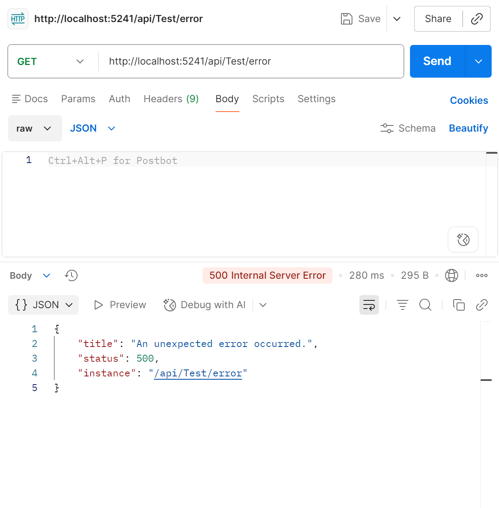
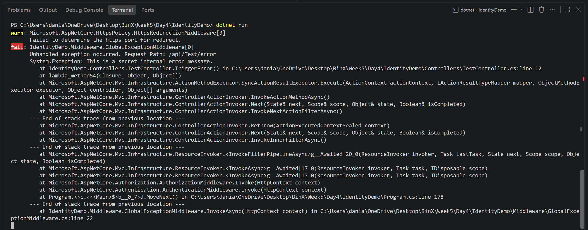

# Day 4 — Centralized Error Handling

## What I Learned
- Implemented global exception handling middleware.
- Used ProblemDetails for standardized error responses.
- Added structured logging using ILogger.
- Prevented exception messages and stack traces from being exposed to clients.

## Testing

### Global Exception Handling

### Structured Logging
