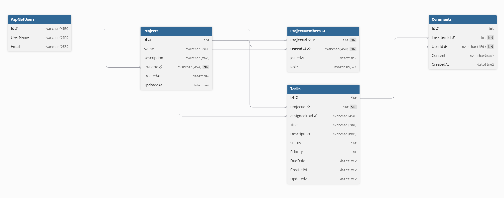
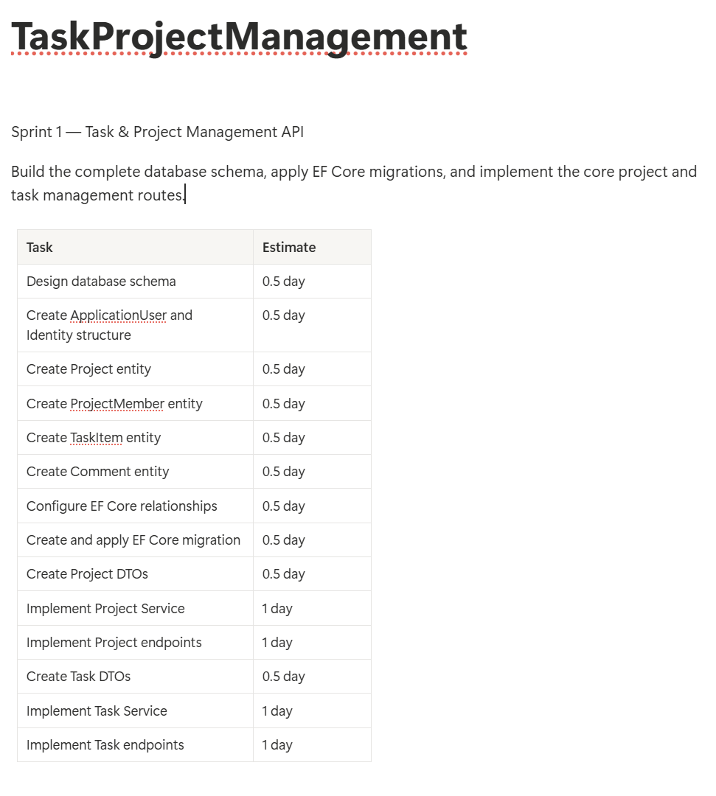

# Task & Project Management API

## Week 6 - Day 1

This project is a Task & Project Management REST API developed as
the Phase 3 capstone project.

## Sprint 1 Goal

Build the complete database schema, apply EF Core migrations,
and implement the core project and task management routes.

## Technologies

- C#
- .NET 9
- ASP.NET Core Web API
- Entity Framework Core
- SQL Server
- ASP.NET Core Identity
- Swagger / OpenAPI
- Git & GitHub

## Database

The project uses SQL Server with Entity Framework Core.

Database:

`TaskProjectManagementDb`

## Main Entities

- ApplicationUser
- Project
- ProjectMember
- TaskItem
- Comment

## Database Relationships

- Users can own multiple projects.
- Projects contain multiple tasks.
- Users can participate in multiple projects through ProjectMember.
- Tasks can contain multiple comments.
- Tasks can optionally be assigned to users.

## Sprint 1 Planning

The sprint backlog is divided into tasks sized approximately
between half a day and one day.

## Migration

The initial database migration is:

`InitialCreate`

## ERD

## Screenshots

### Sprint Backlog

### API Running

