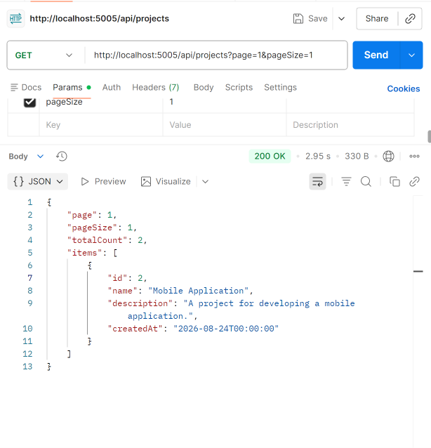
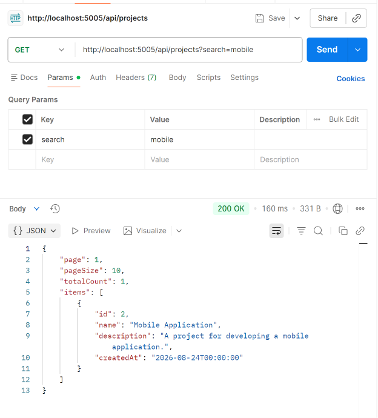
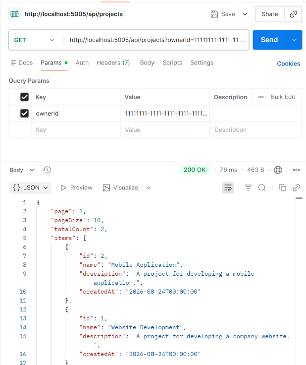
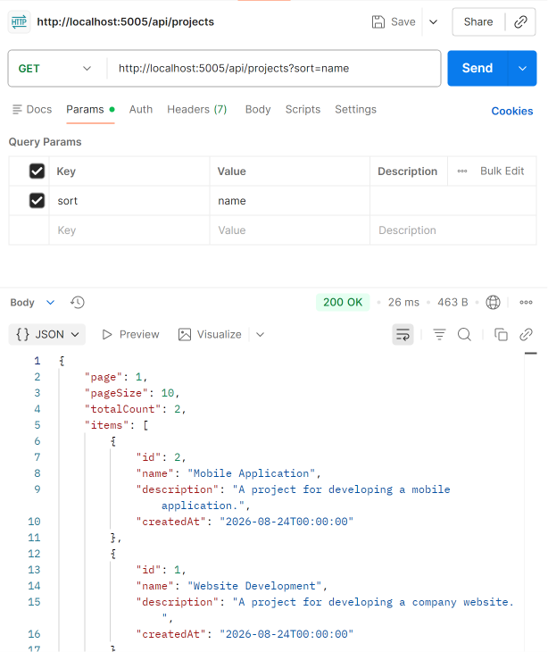
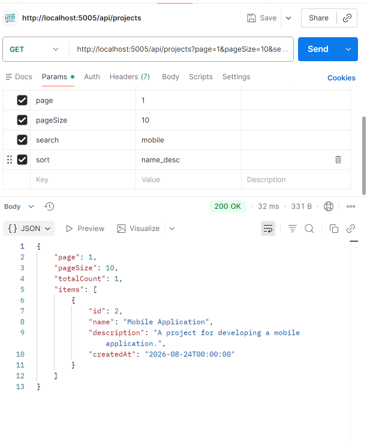

# Day 3 — Core Routes: Catalog & Read Operations

## What I Did

Implemented the core read operations for the Task & Project Management API.

### Features Implemented

- Implemented a paginated `GET /api/projects` endpoint.
- Added pagination using `page` and `pageSize`.
- Added filtering by project name or description using `search`.
- Added filtering by project owner using `ownerId`.
- Added sorting by name, descending name, newest, and oldest.
- Created response DTOs instead of exposing EF Core entities directly.
- Used LINQ with `Where`, `OrderBy`, `Skip`, `Take`, and `Select`.
- Used asynchronous EF Core operations with `CountAsync` and `ToListAsync`.
- Tested the endpoint with different query parameter combinations in Postman.

## Technologies

- C#
- .NET 9
- ASP.NET Core Web API
- Entity Framework Core
- SQL Server
- LINQ
- Postman

## Endpoint

```http
GET /api/projects


## Postman Testing

### Pagination



### Search Filter



### Owner Filter



### Sorting



### Combined Query

