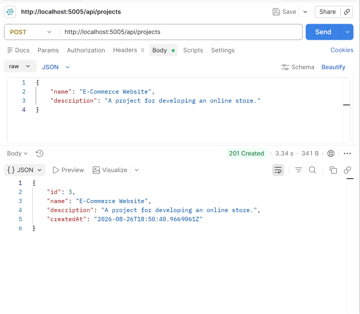
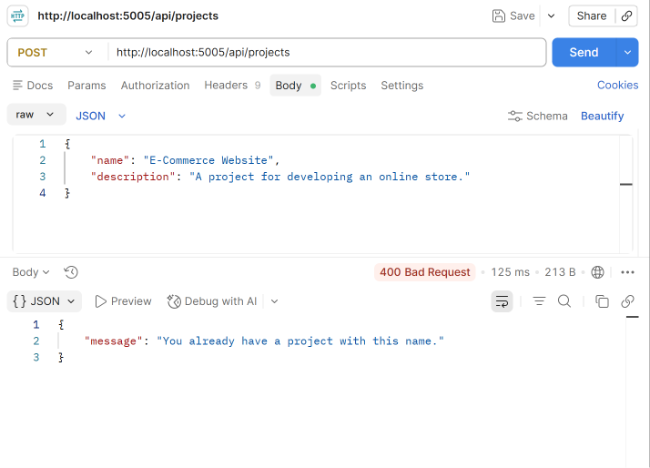
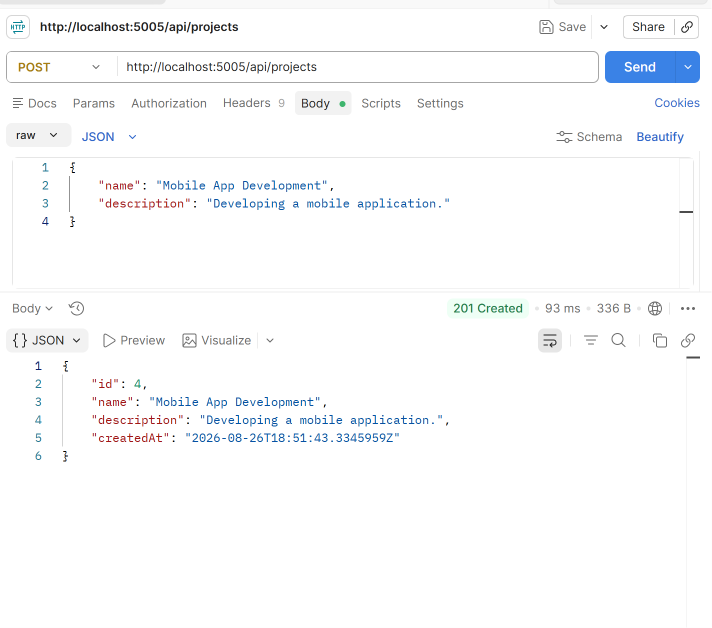

**# Day 4 — Core Routes: Write Operations & Business Logic**

**## What I Did**

Implemented the write operations and business logic for the Task & Project Management API.

**### Features Implemented**

\- Implemented a `POST /api/projects` endpoint.

\- Created `CreateProjectDto` for creating new projects.

\- Created `ProjectService` to handle project creation business logic.

\- Added validation to prevent duplicate project names for the same owner.

\- Automatically assigned the project owner.

\- Automatically set the project creation date.

\- Added the project owner as a `ProjectMember`.

\- Used an EF Core database transaction to handle project creation and member creation as one operation.

\- Added rollback handling if any step of the operation fails.

\- Tested the endpoint using Postman.

**## Technologies**

\- C#

\- .NET 9

\- ASP.NET Core Web API

\- Entity Framework Core

\- SQL Server

\- LINQ

\- Postman

**## Endpoint**

\`\`\`http

POST /api/projects

\`\`\`

**## Request Body**

\`\`\`json

{

  "name": "E-Commerce Website",

  "description": "A project for developing an online store."

}

\`\`\`

**## Postman Testing**

**### Create Project**

Successfully created a new project and received `201 Created`.

**### Duplicate Project**

Trying to create another project with the same name was rejected with `400 Bad Request`.

**### Create Another Project**

Successfully created another project using a different name.

**### Build Success**

The project was successfully built without errors.

Screenshot path:

\`\`\`text

screenshots/day4-build-success.png

\`\`\`

**## Business Logic**

The API checks whether a project with the same name already exists for the same owner before creating a new project.

If a duplicate project is found, the API returns `400 Bad Request`.

\`\`\`json

{

  "message": "You already have a project with this name."

}

\`\`\`

**## Transaction**

The project creation process uses an EF Core database transaction.

The transaction includes:

1. Creating the project.

2. Adding the owner as a project member.

3. Saving the changes.

4. Committing the transaction.

If any step fails, the transaction is rolled back to keep the database consistent.

**## Example Response**

\`\`\`json

{

  "id": 3,

  "name": "E-Commerce Website",

  "description": "A project for developing an online store.",

  "createdAt": "2026-08-26T00:00:00"

}

\`\`\`

**## Result**

The API now supports project creation with real business logic, duplicate validation, project membership creation, and transaction handling. The write operation was successfully tested using Postman.