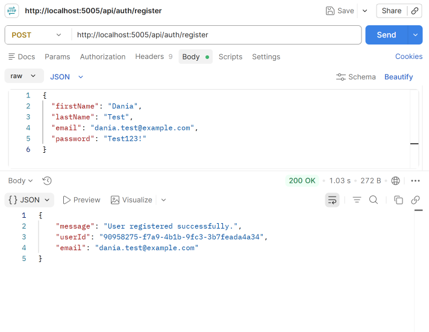

# Day 2 — JWT Login & Registration

## What I Did

Implemented user registration and login using ASP.NET Core Identity and JWT authentication. New users are registered with their personal information and automatically assigned the `User` role. The login endpoint validates the credentials and generates a JWT containing the user's ID, email, and role claims.

## Features Implemented

* User registration using ASP.NET Core Identity.
* Automatic assignment of the `User` role.
* User login with password validation.
* JWT token generation.
* Added user ID, email, and role claims to the JWT.
* Tested the complete registration-to-login flow using Postman.

## Endpoints

```http
POST /api/auth/register
POST /api/auth/login
```

## Postman Testing

### Registration



### Login


## Technologies

* C#
* .NET 9
* ASP.NET Core Identity
* JWT
* Entity Framework Core
* SQL Server
* Postman

## Result

Successfully implemented and tested the complete registration and login flow, with JWT authentication and role-based claims ready for the next authorization tasks.
