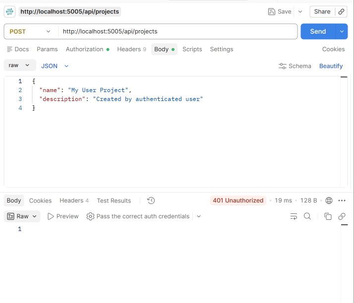
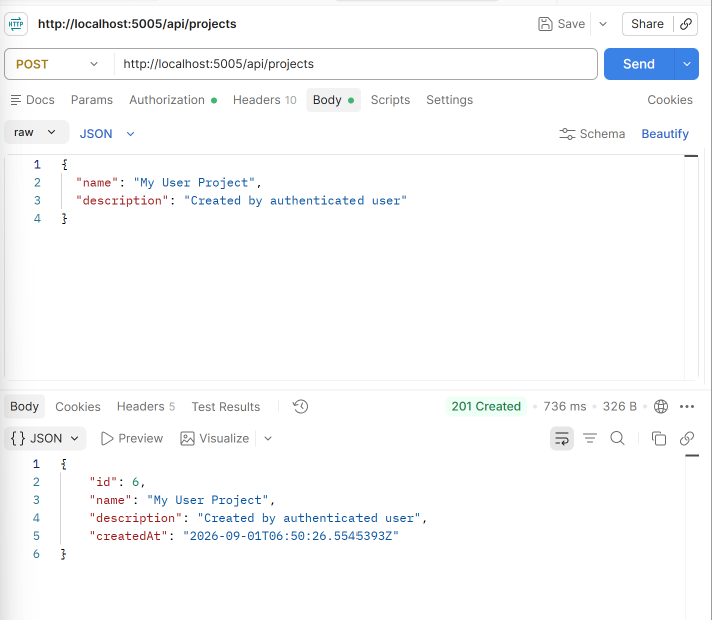
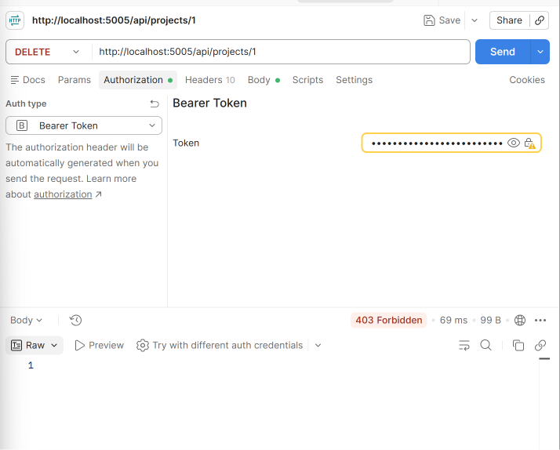

# Day 3 — Role-Based Access Control & Ownership

## What I Did

Implemented role-based authorization and ownership checks in the Task & Project Management API. Authenticated users can create projects, while Admin-only operations are protected by role-based authorization. Ownership checks also prevent users from modifying projects that belong to other users.

## Authorization

* Public access for viewing projects.
* Authenticated users can create projects.
* Admin-only access for deleting projects.
* Project owners can update their own projects.
* Users cannot modify projects owned by another user.

## Postman Testing

### Unauthorized Request — 401

### User Create Project — 201

### Admin Endpoint with User — 403

### Ownership Check — 403

## Technologies

* C#
* .NET 9
* ASP.NET Core Identity
* JWT
* Entity Framework Core
* SQL Server
* Postman

## Result

Successfully implemented and tested role-based access control and resource ownership, ensuring that authenticated users can only perform actions they are authorized to perform.
