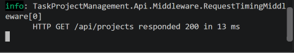

# Day 4 — Custom Middleware

## Overview

Implemented a custom middleware for **HTTP request timing and logging**.

## Implementation

Created `RequestTimingMiddleware.cs` to measure request execution time and log:

* HTTP Method
* Request Path
* Response Status Code
* Execution Time

Registered the middleware globally in `Program.cs`.

## Testing

Tested using:

```text
GET /api/projects
```

The middleware successfully logged the request and response time in the console.

## Screenshot



## Outcome

Successfully implemented and tested a reusable custom middleware without modifying individual controllers.
