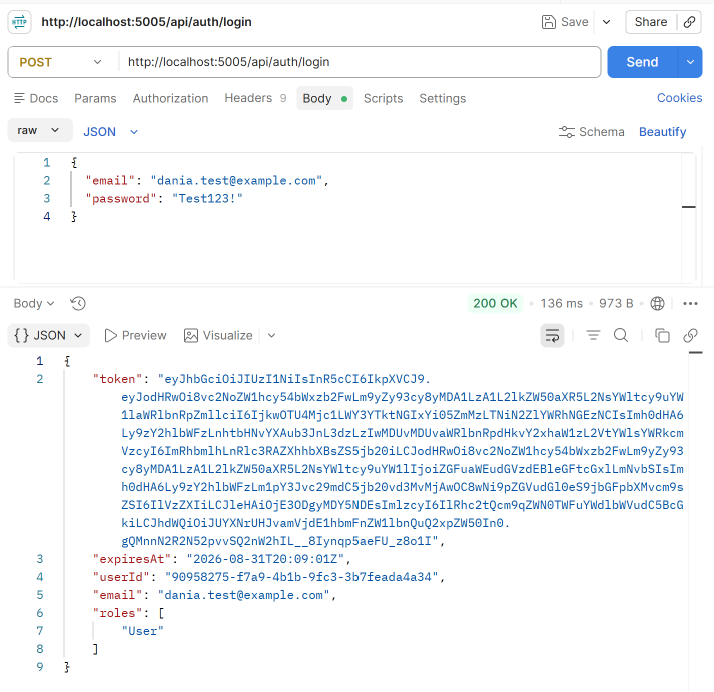
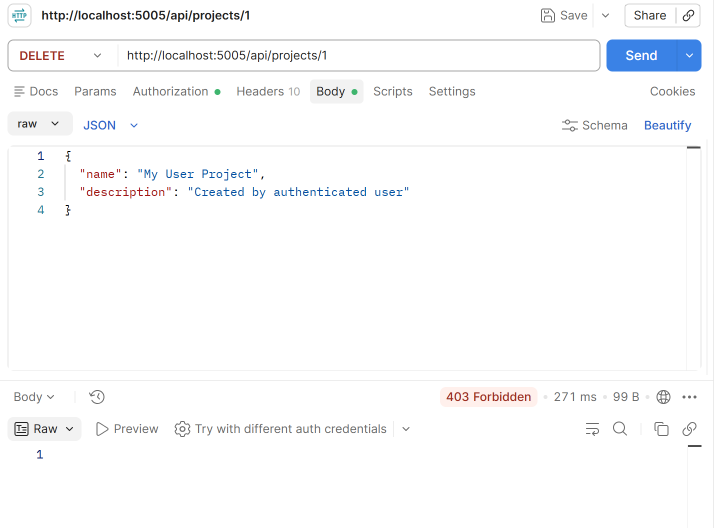

# Day 5 — Sprint Review & Retrospective

## Sprint 2 Review

Completed and demonstrated the main authentication and authorization flow using Postman:

* User registration → `200 OK`
* User login → `200 OK` with JWT token
* Create Project using User token → `201 Created`
* Admin-only Delete using User token → `403 Forbidden`

## Screenshots

## Sprint 2 Retrospective

### What Went Well

* Implemented JWT authentication successfully.
* Added User/Admin roles.
* Applied role-based authorization.
* Added ownership checks.
* Implemented custom middleware for request logging and timing.

### What Could Be Improved

* Add more automated tests for authorization and ownership scenarios.
* Improve coverage of edge cases.

### Sprint 3 Action

Create explicit ownership and authorization tests for every new protected endpoint.
